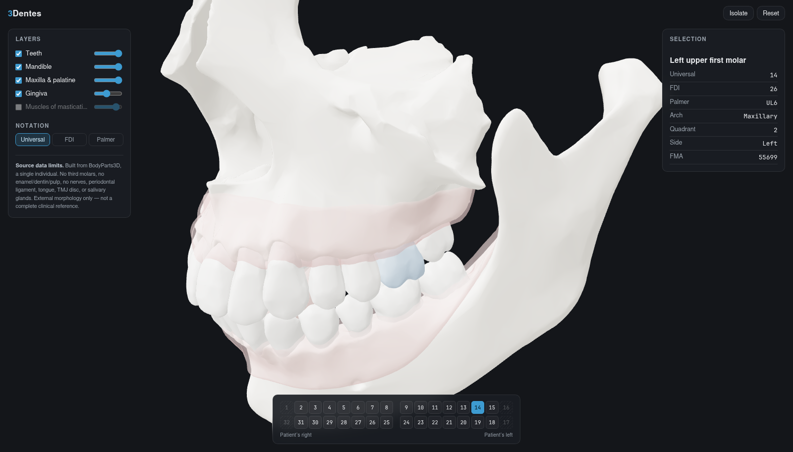
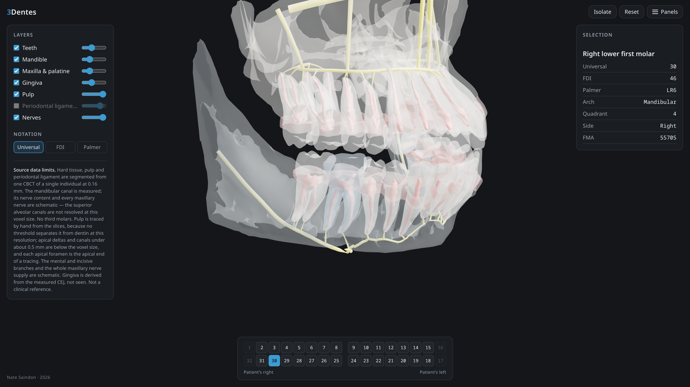

# 3Dentes

Interactive 3D atlas of human oral anatomy, in the browser. One codebase runs on
Linux, macOS, Windows and iPad — install it to the home screen and it works
offline.

**Live: https://natesaindon.github.io/3Dentes/**



The anatomy is segmented from one **cone-beam CT at 0.16 mm isotropic** — hard
tissue, pulp, periodontal ligament, gingiva and the nerve supply, all of one
person. Fading the teeth back is what the layer opacity is for.

## What it does

- **28 individually selectable permanent teeth**, plus the mandible, the
  maxillary alveolar process and palate, and upper and lower gingiva.
- **Internal anatomy**: the **pulp** chamber and canal system of every tooth,
  the **periodontal ligament** space, and the **nerve supply** — the inferior
  alveolar nerve in its measured canal, a branch to all 14 lower apices, the
  mental and incisive terminal branches, and the superior dental plexus with
  PSA, MSA, ASA and the infraorbital nerve above.
- **Clinical notation** — every tooth labelled in Universal, FDI and Palmer, all
  derived from arch/side/position rather than hand-entered.
- **Odontogram** in the standard clinical layout (upper arch on top, patient's
  right on the viewer's left), synced both ways with the 3D view. Selecting a
  tooth on the chart flies the camera to it, approaching from outside the arch
  so the tooth is actually exposed — near-frontal for an incisor, swinging
  buccal for a molar. This is how you reach the posterior teeth, since from a
  frontal view a molar really is hidden behind the premolars in front of it.
- **Layer visibility and opacity**, so you can fade the gingiva and alveolar bone
  back to expose the roots in situ, cut the teeth to 15% to see the pulp inside
  them, or isolate a single structure.



## Where the geometry comes from, and how far to trust it

Different parts of this model stand on very different evidence, and the atlas is
built to keep them apart rather than render them alike:

| | |
|---|---|
| **Measured** | Teeth, mandible, maxilla, the mandibular canal, and the pulp — the pulp traced by hand on the slices, because no threshold separates it from dentin at this resolution. |
| **Derived** | Gingiva, lofted from the measured cementoenamel junction and refitted to the published cervical-line curvature. The periodontal ligament, measured in position but drawn thicker than its true ~0.2 mm, which is barely one voxel. |
| **Schematic** | The nerve *inside* the mandibular canal — CBCT resolves the canal, not its contents. The mental and incisive branches. Every maxillary nerve: the superior alveolar canals are thin, often dehiscent, and not reliably visible at 0.16 mm. |

## What it is not

- **No third molars** — 28 teeth, not 32.
- **One person's anatomy.** Root count, canal configuration and curvature are
  this individual's, not a textbook composite.
- **Resolution limits are real.** Canals under about 0.5 mm and apical deltas
  fall below the voxel size and are not drawn. Apical deltas occur in roughly
  10% of teeth; drawing one at this scale would render it several times its
  true calibre.
- **Two teeth carry metal restorations** whose beam-hardening haloes threshold
  exactly like a pulp lumen. Their pulp is partly inference and is flagged.
- No enamel/dentin split, tongue, TMJ disc, or salivary glands.

This is a study and visualisation aid, **not a complete clinical reference**.
The app states this on screen; please keep it that way in any fork.

Still on the list — including a caries slider, an age-calcification slider, and
arteries and veins — is in [docs/wishlist.md](docs/wishlist.md).

## Running it

```bash
npm install
npm run build:assets   # -> public/dentition.glb + teeth.json
npm run dev            # http://localhost:5173/3Dentes/
```

The STLs are vendored in `assets/cbct/stl/`, so the build works offline. Earlier
versions had a second, BodyParts3D-derived asset tree selected by a
`TOOTH_SOURCE` environment variable; that tree has been removed and there is one
source now.

The CBCT pipeline itself is not part of `npm` — it is the Python in
`tools/cbct/`, and it needs the imaging data, which is not in this repo.

To reach the dev server from an iPad on the same network, `npm run dev -- --host`.

## How it fits together

```
tools/manifest.mjs      which structures to use, their layer, anatomical side,
                        and the notation derivation (single source of truth)
tools/build-assets.mjs  STL -> welded, smooth-shaded, y-up, centred .glb
tools/cbct/             the Python that produced assets/cbct/ from the scan:
                        segmentation, arch split, pulp tracing, gingiva, nerves
src/scene.js            renderer, lighting, camera, camera flights
src/picking.js          raycast selection, drag-vs-click, see-through handling
src/odontogram.js       the tooth chart
src/ui.js               layer, notation and detail panels
src/main.js             wiring and selection state
```

`CLAUDE.md` carries the long-form record of this pipeline — every rule that cost
something to learn, and the things already ruled out. Read it before changing
anything under `tools/cbct/`.

FMA identifiers are the join key throughout: a structure is `FMA55697`
everywhere — the source filename, the glTF node name, and the key in
`teeth.json`.

**The build refuses to produce a mislabelled model.** Two assertions run on every
build. The first is laterality: anatomical right is negative x, and a structure
labelled left that sits on the right fails the build. The second checks the tooth
numbering against the tooth *shapes* — Universal, FDI and Palmer are all derived
from one arch/side/position triple, so they always agree with each other, and
agreeing with each other is not the same as being right. So the teeth are ordered
around each arch geometrically and that order must match the numbering, and
molars and canines are identified from volume, root count and length and must
land on the positions claiming them. `node tools/tooth-morphology.test.mjs`
corrupts the mapping in six plausible ways and confirms each is caught.

### Notes from building it

A few things that were not obvious and are easy to regress:

- **Binary STL is a triangle soup** with no shared vertices and no vertex
  normals. Converting it naively gives ~1M vertices and hard faceted shading.
  Welding bitwise-identical vertices recovers the original topology exactly
  (1,043,478 → 173,956 vertices, 83% fewer) because these STLs came from an OBJ
  whose shared vertices have identical float bits. Welding with a *tolerance*
  would round off cusp tips and occlusal fissures, so it is deliberately exact.
- `@gltf-transform`'s `normals()` generates **flat** normals, not smooth ones,
  hence the hand-rolled area-weighted `computeSmoothNormals`.
- **Indices dominate the file.** At 32 bits they were larger than positions and
  normals combined; every structure welds to well under 65,536 vertices, so
  16-bit indices cut the build from 8.4MB to 6.3MB for free.
- **The build fails if the model is mirrored.** Anatomical right is negative x in
  this dataset; `checkLaterality` asserts every structure labelled left or right
  sits on the expected side. An atlas that confidently mislabels a side is worse
  than no atlas.
- **See-through structures don't absorb clicks.** With gingiva at its default
  45%, the teeth behind it are plainly visible, so a click there should select
  the tooth. Above 60% opacity a structure reads as solid and does take the
  click.

## Licensing

Two things with two different standings:

- **Code** (`src/`, `tools/`) — MIT. See [LICENSE](LICENSE).
- **The anatomy** (`assets/cbct/`, and the `dentition.glb` built from it) — Nate
  Saindon's own scan, published with his explicit consent. **No reuse licence
  has been granted for it**; ask before redistributing.

The atlas previously vendored BodyParts3D meshes under CC BY-SA 2.1 Japan. All
of them have been replaced by measured CBCT anatomy and removed from the
repository, so no ShareAlike obligation reaches any part of this project. Full
detail, including what that inheritance used to cover, is in
[ATTRIBUTION.md](ATTRIBUTION.md).

This repo contains one individual's medical imaging *derivatives*, with consent.
It contains no DICOM, no raw volumes, and no third-party patient data — and it
never should.
